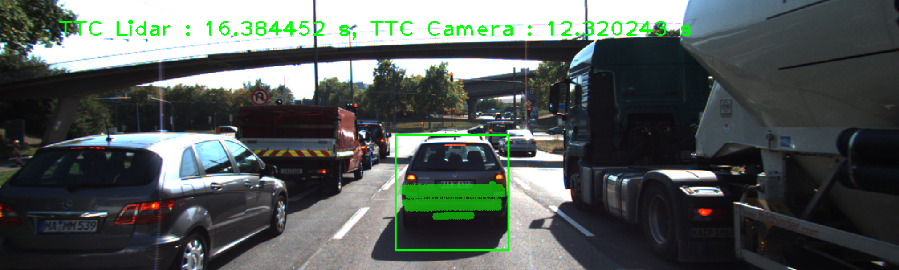
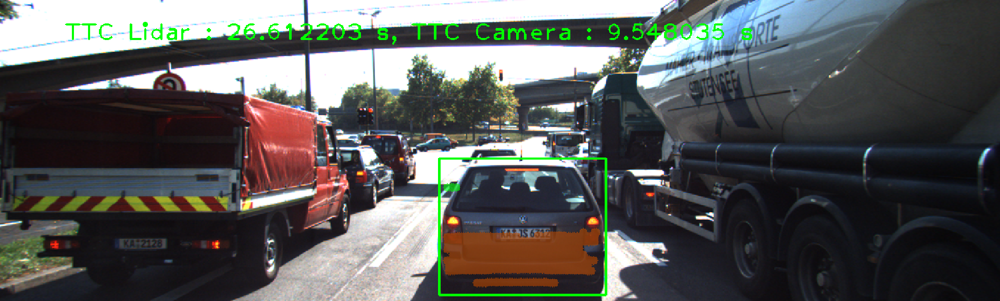
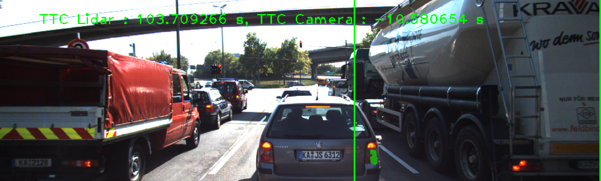
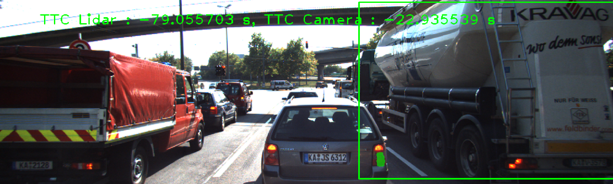
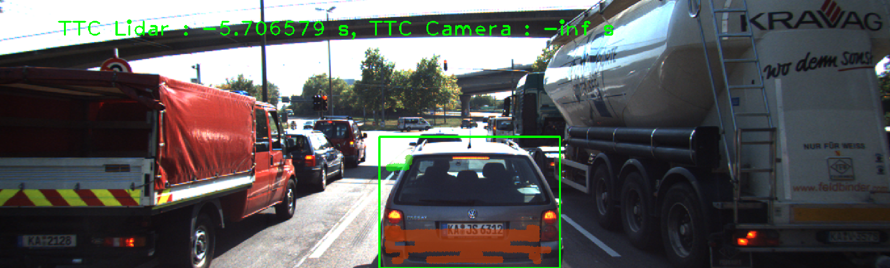

# 3D Object Tracking Technical 
## [Rubric](https://review.udacity.com/#!/rubrics/2550/view) Points
---

#### 1. Match 3D Objects

Implement the method "matchBoundingBoxes", which takes as input both the previous and the current data frames and provides as output the ids of the matched regions of interest (i.e. the boxID property). Matches must be the ones with the highest number of keypoints correspondences.

```c++
void matchBoundingBoxes(std::vector<cv::DMatch> &matches, std::map<int, int> &bbBestMatches, DataFrame &prevFrame, DataFrame &currFrame)
{    
    int p = prevFrame.boundingBoxes.size();
    int c = currFrame.boundingBoxes.size();
    int pt_counts[p][c] = { };
    for (auto it = matches.begin(); it != matches.end() - 1; ++it)     {
        cv::KeyPoint query = prevFrame.keypoints[it->queryIdx];
        auto query_pt = cv::Point(query.pt.x, query.pt.y);
        bool query_found = false;
        cv::KeyPoint train = currFrame.keypoints[it->trainIdx];
        auto train_pt = cv::Point(train.pt.x, train.pt.y);
        bool train_found = false;
        std::vector<int> query_id, train_id;
        for (int i = 0; i < p; i++) {
            if (prevFrame.boundingBoxes[i].roi.contains(query_pt))             {
                query_found = true;
                query_id.push_back(i);
             }
        }
        for (int i = 0; i < c; i++) {
            if (currFrame.boundingBoxes[i].roi.contains(train_pt))             {
                train_found= true;
                train_id.push_back(i);
            }
        }
        if (query_found && train_found) 
        {
            for (auto id_prev: query_id)
                for (auto id_curr: train_id)
                     pt_counts[id_prev][id_curr] += 1;
        }
    }
   
    for (int i = 0; i < p; i++)
    {  
         int max_count = 0;
         int id_max = 0;
         for (int j = 0; j < c; j++)
             if (pt_counts[i][j] > max_count)
             {  
                  max_count = pt_counts[i][j];
                  id_max = j;
             }
          bbBestMatches[i] = id_max;
    } 
    bool bMsg = true;
    if (bMsg)
        for (int i = 0; i < p; i++)
             cout << "Box " << i << " matches " << bbBestMatches[i]<< " box" << endl;
}
```

#### 2. Compute Lidar-based TTC

Compute the time-to-collision in second for all matched 3D objects using only Lidar measurements from the matched bounding boxes between current and previous frame.

```c++
void computeTTCLidar(std::vector<LidarPoint> &lidarPointsPrev,
                     std::vector<LidarPoint> &lidarPointsCurr, double frameRate, double &TTC)
{		     
    double dT = 1 / frameRate;
    double laneWidth = 4.0; // assumed width of the ego lane
    vector<double> xPrev, xCurr;
    // find Lidar points within ego lane
    for (auto it = lidarPointsPrev.begin(); it != lidarPointsPrev.end(); ++it)
    {
        if (abs(it->y) <= laneWidth / 2.0)
        { // 3D point within ego lane?
            xPrev.push_back(it->x);
        }
    }
    for (auto it = lidarPointsCurr.begin(); it != lidarPointsCurr.end(); ++it)
    {
        if (abs(it->y) <= laneWidth / 2.0)
        { // 3D point within ego lane?
            xCurr.push_back(it->x);
        }
    }
    double minXPrev = 0; 
    double minXCurr = 0;
    if (xPrev.size() > 0)
    {  
       for (auto x: xPrev)
            minXPrev += x;
       minXPrev = minXPrev / xPrev.size();
    }
    if (xCurr.size() > 0)
    {  
       for (auto x: xCurr)
           minXCurr += x;
       minXCurr = minXCurr / xCurr.size();
    }  
    // compute TTC from both measurements
    cout << "minXCurr: " << minXCurr << endl;
    cout << "minXPrev: " << minXPrev << endl;
    TTC = minXCurr * dT / (minXPrev - minXCurr);
}
```

#### 3. Associate Keypoints Correspondences with Bounding Boxes

Prepare the TTC computation based on camera measurements by associating keypoint correspondences to the bounding boxes which enclose them. All matches which satisfy this condition must be added to a vector in the respective bounding box.

```c++
void clusterKptMatchesWithROI(BoundingBox &boundingBox, std::vector<cv::KeyPoint> &kptsPrev, std::vector<cv::KeyPoint> &kptsCurr, std::vector<cv::DMatch> &kptMatches)
{
    double dist_mean = 0;
    std::vector<cv::DMatch>  kptMatches_roi;
    for (auto it = kptMatches.begin(); it != kptMatches.end(); ++it)
    {
        cv::KeyPoint kp = kptsCurr.at(it->trainIdx);
        if (boundingBox.roi.contains(cv::Point(kp.pt.x, kp.pt.y))) 
            kptMatches_roi.push_back(*it);
     }   
    for  (auto it = kptMatches_roi.begin(); it != kptMatches_roi.end(); ++it)  
         dist_mean += it->distance; 
    cout << "Find " << kptMatches_roi.size()  << " matches" << endl;
    if (kptMatches_roi.size() > 0)
         dist_mean = dist_mean/kptMatches_roi.size();  
    else return;    
    double threshold = dist_mean * 0.7;        
    for  (auto it = kptMatches_roi.begin(); it != kptMatches_roi.end(); ++it)
    {
       if (it->distance < threshold)
           boundingBox.kptMatches.push_back(*it);
    }
    cout << "Leave " << boundingBox.kptMatches.size()  << " matches" << endl;
}    
```

#### 4. Compute Camera-based TTC

Compute the time-to-collision in second for all matched 3D objects using only keypoint correspondences from the matched bounding boxes between current and previous frame.

```c++
void computeTTCCamera(std::vector<cv::KeyPoint> &kptsPrev, std::vector<cv::KeyPoint> &kptsCurr, 
                      std::vector<cv::DMatch> kptMatches, double frameRate, double &TTC, cv::Mat *visImg)
{
    vector<double> distRatios; // stores the distance ratios for all keypoints between curr. and prev. frame
    for (auto it1 = kptMatches.begin(); it1 != kptMatches.end() - 1; ++it1)
    {
        cv::KeyPoint kpOuterCurr = kptsCurr.at(it1->trainIdx);
        cv::KeyPoint kpOuterPrev = kptsPrev.at(it1->queryIdx);
       
        for (auto it2 = kptMatches.begin() + 1; it2 != kptMatches.end(); ++it2)
        {  
            double minDist = 100.0; // min. required distance
            cv::KeyPoint kpInnerCurr = kptsCurr.at(it2->trainIdx);
            cv::KeyPoint kpInnerPrev = kptsPrev.at(it2->queryIdx);
            // compute distances and distance ratios
            double distCurr = cv::norm(kpOuterCurr.pt - kpInnerCurr.pt);
            double distPrev = cv::norm(kpOuterPrev.pt - kpInnerPrev.pt);
            if (distPrev > std::numeric_limits<double>::epsilon() && distCurr >= minDist)
            { // avoid division by zero
                double distRatio = distCurr / distPrev;
                distRatios.push_back(distRatio);
            }
        }
    }  
    // only continue if list of distance ratios is not empty
    if (distRatios.size() == 0)
    {
        TTC = NAN;
        return;
    }
    std::sort(distRatios.begin(), distRatios.end());
    long medIndex = floor(distRatios.size() / 2.0);
    double medDistRatio = distRatios.size() % 2 == 0 ? (distRatios[medIndex - 1] + distRatios[medIndex]) / 2.0 : distRatios[medIndex];   // compute median dist. ratio to remove outlier influence

    double dT = 1 / frameRate;
    TTC = -dT / (1 - medDistRatio);
}    
```

#### 5.  Performance Evaluation 1

Find examples where the TTC estimate of the Lidar sensor does not seem plausible. Describe your observations and provide a sound argumentation why you think this happened.

Some examples with wrong TTC estimate of the Lidar sensor:

Frame               | Description
--------------------| -------------------
 | TTC from Lidar is not correct because of some outliers. Need to filter outliers.
 | TTC from Lidar is negative because estimation uses mean of all Lidar points that return minXCurr > minXPrev. Need to delete Lidar points from preceding vehicle front mirrors.
 | TTC from Lidar is not correct because of Lidar points from preceding vehicle front mirrors. Need to delete Lidar points from preceding vehicle front mirrors.


#### 6. Performance Evaluation 2

Run several detector / descriptor combinations and look at the differences in TTC estimation. Find out which methods perform best and also include several examples where camera-based TTC estimation is way off. As with Lidar, describe your observations again and also look into potential reasons.

Some examples with wrong TTC estimate of the Camera:

IMAGE               | Description
--------------------| -------------------
 | TTC from Camera is negative because estimation uses vechicle points from right lane that return minXCurr > minXPrev. Need to delete right lane points.
 | TTC from Camera is negative because estimation uses vechicle points from right lane that return minXCurr > minXPrev. Need to delete right lane points.
 | TTC from Camera is negative infinity because medDistRatio == 1. Need to delete right lane points and check medDistRatio to avoid division by zero.

For the final test of all possible combinations of detectors and descriptors, I used CSV writer class to generate these results [CSV](performance_results/Performance.csv).


|Detector+Descriptor type|frame1   |frame2   |frame3   |frame4   |frame5    |frame6   |frame7   |frame8    |frame9   |frame10  |frame11  |frame12  |frame13  |frame14  |frame15  |frame16  |frame17  |frame18  |
|------------------------|---------|---------|---------|---------|----------|---------|---------|----------|---------|---------|---------|---------|---------|---------|---------|---------|---------|---------|
|SHITOMASI/BRISK         |13.368893|13.030504|12.320243|12.752067|12.274682 |13.744860|12.900000|12.621823 |11.455896|12.737609|11.426544|11.728461|12.653150|11.811557|9.386742 |11.104135|11.726440|9.874089 |
|SHITOMASI/BRIEF         |13.774567|13.308032|11.376875|13.085104|12.334163 |13.078128|14.634667|11.755566 |11.492621|12.270018|11.761101|11.399749|12.227710|11.001433|11.120271|12.184849|10.571016|9.478887 |
|SHITOMASI/ORB           |13.567289|12.321901|12.919305|11.803152|12.067221 |13.400744|13.784685|11.596452 |11.198932|14.366072|11.243144|11.935219|12.528686|11.538407|10.232601|11.757526|11.622457|9.227267 |
|SHITOMASI/FREAK         |13.761609|11.851927|11.412623|13.347941|11.640217 |14.238518|12.661157|12.104769 |11.870303|12.114214|11.959904|11.562785|13.347608|12.252640|10.278036|9.348200 |11.589484|7.157780 |
|FAST/BRISK              |12.595108|12.806081|15.957723|12.874340|19.024143 |12.376496|12.133695|11.741703 |12.713836|12.116866|12.312956|11.712586|12.510941|11.627093|11.780525|12.199590|7.162243 |12.640553|
|FAST/BRIEF              |9.038328 |12.496710|13.152563|12.999130|30.296671 |12.182306|10.909307|11.821906 |13.196171|12.965972|14.270176|11.561522|12.272973|11.113363|11.703404|11.842290|10.515494|10.939628|
|FAST/ORB                |11.072101|11.942372|13.766691|12.498360|14.661796 |12.564543|11.513061|11.343173 |13.006009|12.622247|13.502520|12.763530|12.515464|12.252951|11.413974|12.137559|9.748925 |12.125363|
|FAST/FREAK              |12.008644|12.479038|16.987582|13.680523|14.534089 |12.008644|12.196107|12.053083 |12.000830|12.491467|13.006791|12.192042|12.465970|11.136511|10.400000|12.202684|7.772258 |11.088323|
|BRISK/BRISK             |12.865892|16.595705|12.780302|14.840485|28.636491 |17.832318|15.559291|15.919929 |13.967842|10.655235|12.139418|11.109731|11.571685|12.421219|12.471675|10.932869|10.350283|12.351702|
|BRISK/BRIEF             |10.188863|16.132748|11.566230|17.839759|20.475655 |20.604198|14.088164|19.115110 |14.699265|10.176159|11.625099|12.685493|11.507082|10.780921|10.643671|11.720573|10.793659|9.963944 |
|BRISK/ORB               |11.852868|17.178007|13.650208|15.532796|26.330717 |18.952797|12.982926|16.894355 |16.229407|11.339027|12.313319|11.330308|11.640733|13.383044|11.347457|11.415631|8.953753 |12.318886|
|BRISK/FREAK             |11.293901|19.687204|12.204788|14.840485|19.919807 |23.007703|12.053377|15.308844 |17.974928|12.766138|12.504077|10.880147|11.961940|12.214478|14.430224|9.973310 |9.352634 |11.511348|
|ORB/BRISK               |10.675950|13.506805|11.279324|16.489163|41.382721 |10.053625|27.971744|10.665193 |12.009355|11.041877|7.408786 |-inf     |13.732845|11.417125|24.635231|17.196230|20.335089|55.241845|
|ORB/BRIEF               |12.286471|14.042017|19.901709|15.638958|22.397183 |16.192176|19.334925|128.473433|39.376000|11.088170|10.079765|20.167478|12.824510|8.596376 |18.557147|10.951057|8.729498 |19.778292|
|ORB/ORB                 |16.782643|-inf     |20.869026|22.169514|22.273529 |-inf     |-inf     |10.895136 |-inf     |9.582369 |7.861522 |-inf     |11.993061|34.425092|-inf     |10.047069|21.869151|26.182337|
|ORB/FREAK               |12.207445|11.104794|11.328775|12.576109|743.243793|65.746845|-inf     |12.680933 |30.342508|24.441934|8.121179 |8.313420 |8.362929 |9.310102 |8.129184 |7.765476 |11.321919|24.185503|
|AKAZE/BRISK             |11.845504|13.111301|13.091781|13.302662|13.197427 |12.702375|15.647728|13.602259 |14.167294|12.434979|12.093934|10.374281|10.412323|9.704568 |9.481552 |10.068234|8.696532 |8.670772 |
|AKAZE/BRIEF             |12.101016|13.519025|12.006130|13.383948|14.040568 |12.461843|15.466369|14.660722 |12.543066|11.979446|12.939090|11.195293|10.934429|10.807726|9.535192 |9.530254 |8.803489 |8.496581 |
|AKAZE/ORB               |11.161494|13.200077|12.408855|14.711970|13.819379 |13.257185|15.765511|13.384870 |13.309492|11.559726|12.750592|11.022754|11.425814|9.540302 |9.797382 |9.773513 |9.269921 |9.077270 |
|AKAZE/FREAK             |11.502560|12.707681|12.826955|13.933926|14.004325 |14.025021|15.322100|13.117250 |11.562693|11.771526|11.516004|10.546171|10.186065|10.037849|9.385743 |9.976506 |8.460050 |8.730268 |


The TOP3 detector / descriptor combinations as the best choice for our purpose of detecting keypoints on vehicles are:
SHITOMASI detectors and BRISK descriptors         
SHITOMASI detectors and BRIEF descriptors            
SHITOMASI detectors and ORB descriptors 

To be noted that however for overall performance relevant to 2D camera Midterm project, the top three combinations were:
FAST detectors and ORB descriptors
FAST detectors and BRIEF descriptors
FAST detectors and SIFT descriptors

Conclusion: we always look for a balanced solution in terms of performance and reliability.